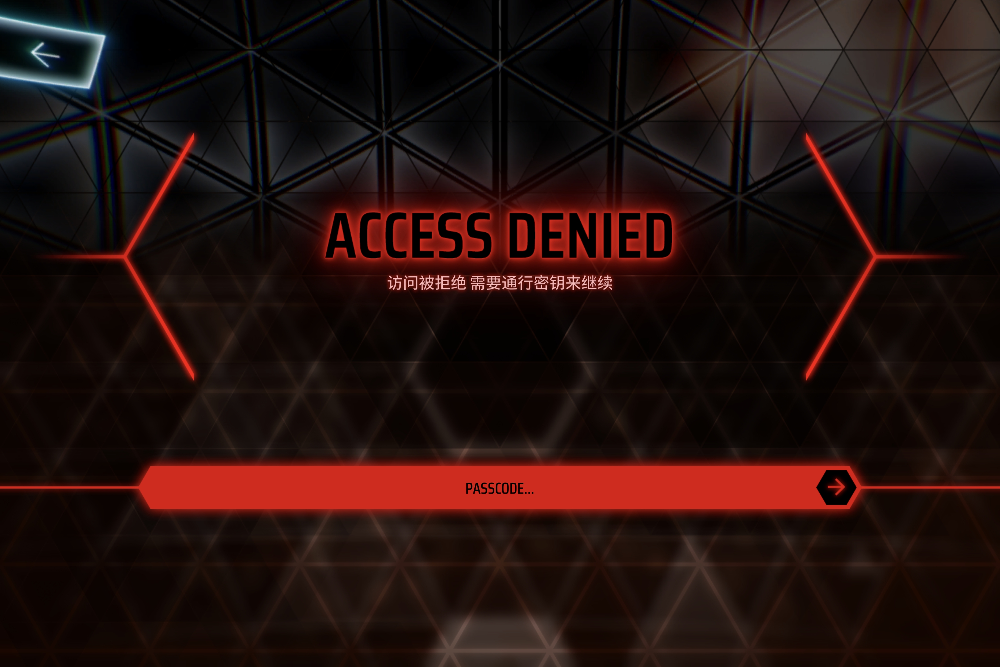

<!-- markdownlint-disable MD033 MD041 -->

<div align="center">

# Phigros 第九章「穹顶孤舟」ARG 解析

Phigros 4.0.1 已更新，该文件暂停更新。

</div>

## Stage I（9 月 5 日起）

[\@Phigros官方](https://space.bilibili.com/414149787/) 在 9 月 5 日晚间的 Phigros 七周年直播中公开了第九章的 PV，并于 9 月 7 日 21 时在哔哩哔哩平台发布了视频[【Phigros】4.0.0 主线第九章更新曲目预览](https://www.bilibili.com/video/BV16vbN6REhD/)。


视频的简介如下：

> Phigros主线最终章——第九章【穹顶孤舟】将于2026年9月25日更新。
>
> 第九章的新曲目分别是：<br/>
>「Implexrough」 by: Silentroom × mommy<br/>
>「Evanescent」 by: LeaF<br/>
>「About The Universe」 by: SOTUI & MIssionary<br/>
>「?」ZGJGDGTDNUIOSQQCLIWWCWIIADNOFQDAEMG<br/>
>「?」left: A - Z. right: PSZLMYQEBJARTFCHNUGVKDOXIW<br/>
>「?」Lmob Xszlh xzm hszggvi gsv nriztv gszg koztfvh gsv rtmlizmg Ullo.
>
> 视频制作：Pigeon Animation Team (汉堡、AiLANE、海产)

对于简介「？」的前 2 行，注意到其使用了 Chaocipher（混沌密码）。

Chaocipher 是 John F. Byrne 于 1918 年发明的加密装置：两个各含 26 个字母的圆盘，左盘（left disk）用于读出密文，右盘（right disk）用于定位明文，两盘以 1:1 的传动比反向咬合。它当年被其发明者视为「不可破」，算法始终保密，直到 2010 年 Byrne 家属把相关手稿与器材捐赠给美国国家密码学博物馆后，完整算法才被 Moshe Rubin 等人公开。

它的每一次操作都由「替换」与「置换」两步构成。替换很直白：在右盘上找到明文字母，取左盘**同一位置**上的字母即为密文。真正让它「混沌」的，是每处理完一个字母，两个盘都要做一次置换——记盘上第 1 位为 zenith（天顶）、第 14 位为 nadir（天底）：

1. **左盘**：先将密文字母转到 zenith；取出 zenith+1 处的字母，令 zenith+2 至 nadir 的一整段左移一位，再把取出的字母插回 nadir。
2. **右盘**：先将明文字母转到 zenith，再整体左移一位；取出 zenith+2 处的字母，令 zenith+3 至 nadir 的一段左移一位，再把取出的字母插回 nadir。

每步只改动字母表的一小段，但被改动过的字母表会一直沿用到后续字母，于是同一个字母在不同位置上会对应不同的密文——这正是它区别于凯撒、Atbash 这类「固定映射」的地方，仅凭密文的统计特征几乎无法破解。

而 Chaocipher 的加密与解密是完全对称的：解密时只需把「在右盘找明文、从左盘读密文」调换为「在左盘找密文、从右盘读明文」，两盘的置换步骤一字不改。

于是，我们将第 1 行作密文，第 2 行作 left disk 和 right disk 的字母表，解密得到

> WERJETZTALLEINISTWIRDESLANGEBLEIBEN

分词后得到一串德语 „Wer jetzt allein ist, wird es lange bleiben“，意为「如今独自一人的人，将长久如此」。这句出自奥地利诗人 *Rainer Maria Rilke*（里尔克）的诗 [*Herbsttag*（《秋日》）](https://de.wikipedia.org/wiki/Herbsttag)。

而对于简介「？」的第 3 行，注意到使用了 Atbash Cipher（Atbash 密码）。

Atbash 是一种最古老也最简单的单表替换密码：把字母表倒过来一一对应，即 A↔Z、B↔Y、C↔X……若字母序号从 0 起，则第 $i$ 个字母映射到第 $25 - i$ 个字母。它的名字来自希伯来字母表首尾的两对字母——aleph 与 tav、bet 与 shin，取四者之名首拼合而成。因为这种映射是「对合」的（它自己就是自己的逆），加密与解密是同一个操作：对密文再做一次 Atbash 便还原成明文。《圣经》中就有它的用例，例如《耶利米书》以「示沙克」（Sheshach）暗指「巴比伦」（Babel）。

解密后可以得到：

> Only Chaos can shatter the mirage that plagues the ignorant Fool.

意为「唯有混沌，才能击碎那困扰无知愚者的幻象。」

同时，在该视频的 1:19 起、1:28 起、1:39 起分别出现了黑白色的三首隐藏曲的 PV。其中：

- 1:19 起，视频左上角显示「SIG : MIRAGE」，右上角显示「CH-7」，下方显示「FVB TBZA NV IF H DHF DOPJO PZ AOL DHF VM PNUVYHUJL」；
- 1:28 起，视频左上角显示「SIG : CHAOS」，右上角显示「CH-7」，下方显示「FVB TBZA NV IF H DHF DOPJO PZ AOL DHF VM PNUVYHUJL」；
- 1:39 起，视频左上角显示「SIG : TRUTH」，右上角显示「CH-3」，下方显示「BRX PXVW JR WKURXJK WKH ZDB LQ ZKLFK BRX DUH QRW」。


不难注意到这是 Caesar Cipher（凯撒密码），偏移量即 `CH-?` 中的数字。反向偏移后可以得到明文：

> YOU MUST GO BY A WAY WHICH IS THE WAY OF IGNORANCE<br/>
> YOU MUST GO BY THE WAY OF DISPOSSESSION<br/>
> YOU MUST GO THROUGH THE WAY IN WHICH YOU ARE NOT

意为：

> 你必须经由无知之途。<br/>
> 你必须经由舍弃占有之途。<br/>
> 你必须经由你并不存在之途。

这三句均出自 [T. S. Eliot（托马斯·斯特恩斯·艾略特）](https://en.wikipedia.org/wiki/T._S._Eliot)的诗 [*East Coker*（《东科克》）](https://en.wikipedia.org/wiki/East_Coker_(poem))，是其诗集 [*Four Quartets*《四个四重奏》](https://en.wikipedia.org/wiki/Four_Quartets) 的第二篇。

在视频公开的同时，D.O.M.E. 在林泊百科[「谜题保管所:孤舟」](https://wiki.pigeon-games.com/index.php?title=%E8%B0%9C%E9%A2%98%E4%BF%9D%E7%AE%A1%E6%89%80:%E5%AD%A4%E8%88%9F)中添加内容「Solivault」：


根据提示，经过尝试，将解谜得到的字符串 `WERJETZTALLEINISTWIRDESLANGEBLEIBEN` 拼接到林泊百科的 URL `https://wiki.pigeon-games.com` 之后，即

```text
https://wiki.pigeon-games.com/WERJETZTALLEINISTWIRDESLANGEBLEIBEN
```

访问这个页面，我们得到了一张名为 `Solivault` 的 `.png` 图片，随后这一解密进展被 D.O.M.E. 认可，D.O.M.E. 在林泊百科的「谜题保管所:孤舟」页面追加了解谜答案，并附

> 不要就此结束念想，你们还会回来的。


页面的图片中隐约包含两个角色，其上半部分做了黑暗处理。查看该页面的 HTML 源码，我们发现了这样的 JavaScript 逻辑：

```javascript
const stage = document.getElementById('stage');

stage.addEventListener('click', () => {
  if (document.fullscreenElement) {
    document.exitFullscreen().catch(() => {});
  } else {
    document.documentElement.requestFullscreen().catch(() => {});
  }
});

stage.addEventListener('dblclick', (e) => {
  e.preventDefault();
  stage.classList.toggle('contain');
});
```

这使得页面能够响应用户的点击请求，在单击时，页面进入或退出全屏；在双击时，页面切换 `#stage` 的 `contain` 类，从而改变图片的 `object-fit`。但这也间接导致图片无法被拖拽或长按选择，常规方法难以保存。同时，访问该 URL 必须携带正确的 User-Agent，否则页面将返回错误码 HTTP 773。


不难获得图片的来源地址：

```text
https://ch9.oss-cn-beijing.aliyuncs.com/Solivault.png
```

图片存放于阿里云的 OSS，且进行了防盗链处理，会对 Referer 非 `https://wiki.pigeon-games.com/` 的请求返回 403。图片的 `Last-Modified` 时间为 2026 年 9 月 10 日 18:21 CST，大小为 2,160,381 字节，约 2.06 MiB。第一部分的解谜到此结束。

另外，此时已经有玩家发现视频中「SIG : TRUTH」段的 BGM 疑似是 *816ThreeNumbers* 的歌曲 *True Home, True World*，但并没有确证。


## Stage II（9 月 25 日起）

9 月 25 日晚 17:00，Phigros 更新了 4.0.0 版本。

### 第一部分歌曲解锁

解锁第九章的前置条件是在第八章的最终曲目 *Distorted Fate* 中得分超过 880,000。进入第九章后，阅读情节《D.O.M.E.》，解锁并阅读情节《行与憩》，最终解锁剧情《破译：Evanescent》和《破译：Implexrough》。在「穹顶孤舟」的地图向左上角滑动，阅读剧情《归零》后解锁剧情《破译：About The Universe》。

注意到《破译：Evanescent》、《破译：Implexrough》和《破译：About The Universe》中，均存在关键词「人类」：


#### About The Universe

在《过去的章节》中游玩曲目「HumaN」后继续，即解锁曲目《About The Universe》。

#### Evanescent

重新查看所有剧情后，在「收藏品」页面确保所有的收藏品页面均已读，随后游玩曲目《Doppelganger》，在后半段进入异象并卡死时退出曲目游玩，即进入《Evanescent》。

#### Implexrough

在《单曲精选集》中长按或连续点击左上角的「随机」按钮直到随机到歌曲《Random》，开始游玩后进入曲目《Implexrough》。游玩结束后弹出部分单句剧情。

#### Entrance to the Chaos

重新进入「穹顶孤舟」的地图，解锁并阅读剧情《破译：Implexrough · 线索一》，点击后方的歌曲区块后进入异象歌曲选择界面，选择难度后点击开始游戏即可进入连续三首歌的完美挑战。

<!-- 这里需要补一张图片。 -->

完美挑战在初始情况下的游戏规则是

> 出现非Perfect判定时-1//Life耗尽时强制结束游戏

在初始情况下，默认血量为 10，可以在 1 和 10 中选择。在第一次挑战失败后，可以解锁血量 50。在第二次挑战失败后，可以解锁新的游戏规则

> 出现Bad/Miss判定时-1//Life耗尽时强制结束游戏

且血量解锁为 100，在再次失败后解锁到 200。该规则下玩家可以轻松通关。在按照顺序游玩前两首歌曲后，出现第三首歌曲《Entrance to the Chaos》，并在玩家通关后正式解锁。游玩结束后弹出部分单句剧情。

<!-- 图片！ -->

#### Exoplanetary Mirage

重新阅读所有剧情，随后进入课题模式，发现第九章的两首歌曲（《Evanescent》和《About The Universe》）的曲名和曲绘均翻转，按照顺序选择《Evanescent》和《About The Universe》两首歌，随后可以解锁完美挑战，规则同上，在第一次游玩时解锁血量到 100，第二次到 200。

在三首歌全部通关后，解锁最终曲目《Exoplanetary Mirage》。游玩结束后弹出部分单句剧情。

<!-- 图片！ -->

事实上，由于解锁时使用的判定为课题模式的严格判定，初见的成绩不会作为正常模式的成绩，玩家需要重新游玩曲目并解锁 AT 难度。

在完成 2 首表魔王曲的解锁后，我们于「穹顶孤舟」的地图向上滑动，发现了一个闪烁的隐藏曲目占位符，点击后弹出「ACCESS DENIED」界面，显示

> 访问被拒绝 需要通行密钥来继续

同时，下方提供一个输入框可供输入通行密钥（PASSCODE）。玩家几乎尝试了绝大多数可能的密钥，均不能成功解密。事实上，这个密钥必须通过 [林泊百科的解密](#林泊百科的解密) 获得——有解包者尝试分析了游戏本体，并确认了这一点。



在输入正确的密钥后，游戏进入隐藏曲目《True Home, True World》的前半段，并进入演出和一段剧情。至此，第九章第一部分解锁告一段落。

### 对游戏本体的分析

> [!WARNING]
>
> 根据[《Phigros》同人创作及第三方项目规范（2026版）](https://www.bilibili.com/opus/1243010548197490696) 的「第六条 程序、资源、数据与网络服务」的相关规定，下文中的内容仅作为对该 ARG 解谜过程中玩家的一种解谜思路的记录。笔者遵守 Phigros 官方的规范，同时也不鼓励对游戏本体进行逆向工程等的行为。下文中所记录的内容经过了一定的混淆和修改。
>
> > 未经授权，不得提取、复制、上传、公开传播、重新打包、销售、交换或向第三方提供《Phigros》的游戏程序、资源文件、未公开数据及其他受保护内容。
> >
> > 不得以获取或传播游戏资源、复制游戏程序、制作替代性产品、提供作弊功能或实施其他侵害合法权益的行为为目的，通过拆包、破解、反编译、绕过技术保护措施、截取非公开通信、攻击或干扰网络服务、非法获取数据等方式，取得、还原或使用前述内容。

<details>
<summary>「ACCESS DENIED」页面的实际解密流程</summary>

「ACCESS DENIED」页面要求玩家输入正确的通行密钥（PASSCODE），在回车确认后，程序调用函数 `Submit`，取输入框 `inputField` 的值，校验其长度大于 0 后，将原始值直接传给 `SetPassword` 函数。函数对传入的值 `password` 计算 SHA-512 哈希（共 64 字节），切片其 `0..32` 的 32 字节作为 `aes.Key`、`32..48` 的 16 字节作为 `aes.IV`，并使用这对 AES 密钥尝试通过 Addressables 异步加载加密的 Unity bundle，确认回调函数 `b__6_0` 的校验情况。这里，回调函数 `b__6_0` 使用用户输入的密钥尝试解密名为 `c9s.test` 的 `TextAsset` 类型的加密资源，通过判断其值是否等于 `pass` 以校验用户输入的密钥是否正确。

若正确，则程序最终调用 `Decrypt` 函数解密出最后的游戏资源。
</details>

由于隐藏曲使用了 AES 加密，在没有密钥的情况下，加密的文件密码学上不能恢复。这也是为什么解包者不能通过单纯的解包获得隐藏曲目。

在后文我们得到了密钥后，可以复现这一解密过程。在解密后的文件中，我们得到了一段 68.5 s 的 `.wav` 文件，来自于 *816ThreeNumbers* 的歌曲 *True Home, True World*，印证了前文的猜想。这也说明了，在 Phigros 4.0.0 的游戏本体中，隐藏曲仅包含了前 68.5 s 的音频，并不包含完整曲目。

### 林泊百科的解密

玩家再次访问先前的林泊百科页 [WERJETZTALLEINISTWIRDESLANGEBLEIBEN](https://wiki.pigeon-games.com/WERJETZTALLEINISTWIRDESLANGEBLEIBEN) 后，可以发现该页面内容已经发生改变，背景是一张扭曲过后的星体图片，上方浮现了一个为期 7 天的倒计时。


archive.org 保留了一份 2026 年 9 月 25 日晚 7 点的 [网页快照](https://web.archive.org/web/20260925113526/https://wiki.pigeon-games.com/WERJETZTALLEINISTWIRDESLANGEBLEIBEN/)。

#### WERJETZTALLEINISTWIRDESLANGEBLEIBEN

分析 [该页面的 HTML 源码](/artifacts/stage_ii/WERJETZTALLEINISTWIRDESLANGEBLEIBEN/WERJETZTALLEINISTWIRDESLANGEBLEIBEN.html) 可知，页面倒计时的截止时间是 2026-10-02 17:00:00（+08:00）。时钟并不取自 `Date.now()`，而是用内嵌的时间戳 `window.SV_EMBED_MS` 初始化，再加上从页面初始化起经过的高精度时长；只有在没有这个内嵌时间戳时，它才会退回去从 `ntp.php`、`timeapi.io` 和 Cloudflare `cdn-cgi/trace` 获取网络时间，成功后每 10 分钟再同步一次（见下文 [Stage III](#stage-iii10-月-2-日起)）。

页面从 `https://c9.gaoice.run/start.png` 加载背景图，随后用多个 canvas 分层渲染像素位移、红雾、噪点、火花粒子、CRT 扫描线、暗角、红蓝色差、畸变等。页面固定按照 1920x1080 设计，再用 CSS 缩放到当前屏幕。在移动端打开时，倒计时会竖排显示。

我们注意到该 HTML 的第 10 行和第 199 行分别有两个 `<script>` 块，其 JavaScript 代码进行了混淆。使用 [toolapi 的 JavaScript 反混淆器](https://www.toolapi.cc/jsreverse/) 可以反混淆这些代码，反混淆后的代码参见 [L10.js](/artifacts/stage_ii/WERJETZTALLEINISTWIRDESLANGEBLEIBEN/L10.js) 和 [L199.js](/artifacts/stage_ii/WERJETZTALLEINISTWIRDESLANGEBLEIBEN/L199.js)。

其中，第 199 行的代码是用来渲染页面效果的；而第 10 行的代码包含了这样的逻辑：脚本从 `c9.gaoice.run` 加载背景图后，通过

```javascript
if (
    a.length < 8 ||
    a[0] !== 137 ||
    a[1] !== 80 ||
    a[2] !== 78 ||
    a[3] !== 71
) {
    return 0;
}
```

校验 PNG 的魔数 `0x89 'P' 'N' 'G'`，之后通过

```javascript
let b = 8;
while (b + 8 <= a.length) {
    const c =
        ((a[b] << 24) | (a[b + 1] << 16) | (a[b + 2] << 8) | a[b + 3]) >>>
        0;
    const d = String.fromCharCode(a[b + 4], a[b + 5], a[b + 6], a[b + 7]);
    b += 12 + c;
    if (b > a.length) {
        return 0;
    }
    if (d === "IEND") {
        return b;
    }
}
```

遍历 PNG chunk，直到到达照片的 `IEND` 块后返回值，返回的即为第二张 PNG 的起始偏移。随后

```javascript
const f = URL.createObjectURL(
    new Blob([e.subarray(c(e))], {
        type: "image/png",
    }),
);
```

脚本截取第二个 PNG 起点到文件末尾的数据，取为 `"image/png"` 的 blob，并调用 `createObjectURL` 生成临时 `ObjectURL`。之后的 JavaScript 代码加载了第二张 PNG 作为 `bgImg.src`，即在页面上显示第二张 PNG；如果解析失败，则回滚到第一张 PNG。

要理解这张图为什么能「一张顶两张」，需要先看 PNG 自身的文件结构。PNG 是由一个个块（chunk）串起来的格式：文件以固定的 8 字节签名开头，即 `89 50 4E 47 0D 0A 1A 0A`（`0x89`、`P`、`N`、`G`、CR、LF、`0x1A`、LF），其唯一作用就是让人一眼认出「这是 PNG」。其后是一连串数据块，每个块的结构完全一致：

| 字段 | 长度 | 说明 |
| --- | --- | --- |
| 长度 | 4 字节 | 仅指其后「数据」段的字节数（大端序），不含本字段及类型、CRC |
| 类型 | 4 字节 | 4 个字母的块名，如 `IHDR`、`IDAT`、`IEND`、`tEXt` |
| 数据 | 由「长度」决定 | 块的实际内容 |
| CRC | 4 字节 | 对「类型 + 数据」计算的 CRC-32 校验值 |

因此，只要知道一个块的位置和它的长度字段，就能直接跳到下一个块——脚本里 `b += 12 + c` 正是这个意思：除数据本身外，每个块固定多出 $4 + 4 + 4 = 12$ 字节（长度、类型、CRC）。

块分两类：关键块（类型首字母大写）与辅助块（类型首字母小写）。关键块必须被每个解码器识别，包括 `IHDR`（图像头，声明宽高、位深、色彩类型等）、`IDAT`（实际像素数据，可拆成多块）、`IEND`（结束块）；辅助块如 `tEXt`（纯文本）、`zTXt`（压缩文本）、`gAMA`、`pHYs` 等，解码器遇到不认识的辅助块可以直接跳过。这里的关键在于：**解码器读到 `IEND` 便认为图像到此为止，其后的字节一律忽略**。于是人们常在 `IEND` 之后接上第二张完整的 PNG（乃至任意数据），凑成一个既能在看图软件里正常显示、又「内含多张图/额外数据」的多态文件（polyglot）。本题的拼图脚本之所以要「逐块走到 `IEND`、再取其后全部数据」，依据的正是这一点。

至于 binwalk，它是一款用来「在文件里找文件」的二进制/固件分析工具，核心是**签名扫描**：它内置一份魔术签名库，把目标文件按字节逐偏移地与库中各种文件头的特征字节串比对，一旦命中，就在该偏移处报告「这里可能是一个某类型的文件」。默认情况下，它对每种签名往往只报告首个命中；加上 `-a`（`--search-all`）后会搜索所有偏移，从而把埋在文件各处的同类文件头一并列出。对 `start.png` 执行 `binwalk -a start.png`，输出里出现了两条 `PNG image`：

```text
0        0x0       PNG image, total size: 3139459 bytes
3139459  0x2FE783  PNG image, total size: 583504 bytes
```

第一条在偏移 0，即图像 A 的头部；第二条在偏移 `0x2FE783`，正是图像 A 的末尾，也就是第二张 PNG 的起点。两条记录的长度之和 $3{,}139{,}459 + 583{,}504 = 3{,}722{,}963$ 又恰好等于整个文件的大小，说明这个文件就是「两张 PNG 首尾相接」。据此，按第二条记录的偏移把后半段裁出来，即可得到分离的两张图。需要留意的是，binwalk 只是「按签名猜测」，并不做严格解析，因此既可能漏报（签名不在库中），也可能误报（随机字节恰好命中）。

我们下载得到 [`start.png`](/artifacts/stage_ii/WERJETZTALLEINISTWIRDESLANGEBLEIBEN/start.png)，随后使用 `binwalk -a start.png` 确证 `start.png` 的确由两张图片合成，使用 `dd` 或脚本提取得到空间位置上前后的两张图片 `start.layer1.png` 和 `start.layer2.png`。WER... 页面上渲染的是 `start.layer2.png`。


这是 `start.layer1.png`：


这是 `start.layer2.png`：


编写 Python 脚本，取两张照片的 diff，可以注意到两张照片的差异几乎 100% 集中在单个像素级的抖动上，低频内容（也就是「照片本身」）是同一张。脚本存放于 [diff_layers.py](/artifacts/stage_ii/WERJETZTALLEINISTWIRDESLANGEBLEIBEN/diff_layers.py)。

```python
#!/usr/bin/env python3
import sys
from pathlib import Path

from PIL import Image, ImageChops

here = Path(__file__).parent
l1, l2 = here / "start.layer1.png", here / "start.layer2.png"
a_path, b_path = ([Path(p) for p in sys.argv[1:3]] + [l1, l2])[:2]

a, b = (Image.open(p).convert("RGB") for p in (a_path, b_path))

ImageChops.difference(a, b).point(lambda v: min(255, v * 8)).save(
    here / "start.diff_x8.png"
)
```


同时，用肉眼观察 `start.layer1.png`，我们也可以发现图片有细微而连续的波动，在四个角落尤其明显。这暗示我们需要对图片进行二维 Fourier 变换。

我们平时看一张图片，用的是它的**空间**表示：以像素坐标 $(x, y)$ 给出每个位置的颜色，这叫空域（Spatial Domain）。Fourier 变换换了一个角度看同一张图——它把图像拆成一大堆不同方向、不同波长（频率）、不同强度的正弦波纹理的叠加。可以这样理解：拿一堆疏密与方向各异的「条纹模板」去逐个套原图，某种条纹在原图中出现得越整齐、越强，对应的系数就越大；把所有这些「条纹有多强」按频率排开，就得到了频域（Frequency Domain）图。

在频域图里，某个点到中心的距离代表条纹的疏密（频率），该点的方向代表条纹的走向，亮度则代表这种条纹的强度。于是低频（靠近中心）对应大片平滑的渐变、整体的明暗与轮廓；高频（远离中心）对应物体的边缘、文字笔画、细碎杂色与噪点。这正是一张普通照片的频谱看起来像一团弥散的云雾，而一旦图中藏有**周期性**的东西（规则的网格、被整齐调制过的痕迹等），频谱上就会冒出格外对称、格外明亮的点或线的原因——也正因如此，Fourier 变换常被用来「照」出这类隐藏信息。

我们对 `start.layer1.png` 编写二维 Fourier 变换脚本：

```python
#!/usr/bin/env python3
import sys
from pathlib import Path

import numpy as np
from PIL import Image

here = Path(__file__).parent
p = Path(sys.argv[1]) if len(sys.argv) > 1 else here / "start.layer1.png"

a = np.asarray(Image.open(p).convert("L"), dtype=float)
m = np.log1p(np.abs(np.fft.fftshift(np.fft.fft2(a))))
m = (255 * (m - m.min()) / (m.max() - m.min())).astype("uint8")
out = here / f"{p.stem}.fft.png"
Image.fromarray(m).save(out)
print(f"{p.name} {a.shape[1]}x{a.shape[0]} → {out.name}")
```

该脚本存放于 [fft_view.py](/artifacts/stage_ii/WERJETZTALLEINISTWIRDESLANGEBLEIBEN/fft_view.py)。脚本读入图片并转为灰度图（L 模式），并转成 float 数组，随后对其作 2D 快速 Fourier 变换、中心化和对数压缩动态范围，归一化到 0\~255 并转成 8 位无符号整数，最终输出为 PNG 图片。这里：

1. `fft2` 计算出的结果默认将零频（直流分量，即图片的平均亮度）放在了数组的四个角落。默认情况下，低频在四个角落会使得输出的图片散乱。我们使用 `fftshift` 做一次象限对调，将零频移动到了图像的正中心，这样画出的频谱图将呈现出中心对称，使人能更容易看出隐藏的信息。
2. 最后，我们对输出作 `np.log1p(...)`，这即 $\ln(1 + x)$，它对输出做了一次动态范围对数压缩，将微弱的细节提亮，显露出隐藏在频域中的图案；随后再做一次线性归一化，将幅值映射到 $[0, 255]$ 并转成 8 位无符号整数，以便保存为 PNG 图片。

处理后我们得到了 `start.layer1.fft.png`：


截取上半部分的隐藏信息，我们得到：


字符串 `outside_the_birdcage`。

事实上，更好的做法是对 diff 图片作二维 Fourier 变换。由于 `layer1` 图片是由

1. `layer2` 图片，作为底图；
2. `diff` 图片，是 ARG 出题人隐写字符串的图片

叠加而来，所以对 `diff` 图片作 Fourier 变换可使得得到的隐藏信息更加清晰。该脚本位于 [fft_view_diff.py](/artifacts/stage_ii/WERJETZTALLEINISTWIRDESLANGEBLEIBEN/fft_view_diff.py)，得到的结果如下：


#### outside_the_birdcage

将 `outside_the_birdcage` 拼接到 `https://wiki.pigeon-games.com` 之后，访问得到了新的页面，一个格状背景图上方显示了一串字符串。


下载该页面的 HTML，在 `<meta>` 块中，我们得到了鸽游官方的提示：

```html
<meta name="hint" content="To our non-Chinese players: during our review, we found an information gap between mainland China and overseas that may leave you stuck on the puzzles. 
If you've made it this far but have no idea how to proceed, visit Bilibili and browse the Phigros official account's past posts. Earlier puzzles may give you the inspiration you need.">
```

> 对于非中文的玩家：审查期间，我们发现中国大陆的玩家和海外玩家之间存在信息差，可能会让你们卡在谜题上。<br/>
> 如果走到这一步，但你不知道怎么办，可以去哔哩哔哩上看 Phigros 官方的历史投稿，早期的谜题或许会给你灵感。

并在后文中得到了一个 [JavaScript 脚本](/artifacts/stage_ii/outside_the_birdcage/711f2f61b954952722263a03-text.js)。分析后发现，该脚本的 `fingerprint()` 函数收集了大量的浏览器和环境信息，包括 User-Agent、语言、平台、硬件并发数、设备内存、触摸点数、屏幕尺寸、色彩深度、`devicePixelRatio`、时区、`Intl` 时区、Canvas 绘制文字后的 `toDataURL()` 尾部、WebGL 的 vendor/renderer 信息等，最后将这些内容拼成一个字符串，用不同的 seed 做四次 FNV 哈希（`fnv(str, seed)`），拼成 32 位十六进制字符串（`hex8(n)`）。

随后，网页从服务器同步文本：`syncFromServer()` 使用上面计算得到的指纹请求同源接口 `api.php?fp=<fingerprint>`，解析其得到的 JSON 并显示响应传回的字符串。例如，我们打开 F12 开发人员工具的 Network 标签页，可以看到一次请求：


这次对 `api.php` 的请求得到了响应

```json
{"ok":true,"index":12,"text":"1$R&fuH6AbuN","total":13}
```

其中的 `text` 就显示在了页面上。这里，`"index":12` 表明这是第 12 个字符串。经过玩家的枚举尝试，最终得到了 13 个字符串，经过 `sort` 排列后得到

```text
$6&Dj#f=6T+I
1$R&fuH6AbuN
ALes@K3@MtmE
?aT?~!4*jK^D
C4_tubAxU+/S
E&r%JaM/9_,I
G#TroCyuuH#P
IV7aN2emf9nS
N2riNdAuY~US
Nf9etodigrAO
OU/@ig=!9~VS
R#m6Aya#N=$S
u~D4wBeN3i_O
```

我们注意到，这 13 个字符串的末尾均为大写字母；`rev | sort` 后得到 7 个不重复的字母 `D`, `E`, `I`, `N`, `O`, `P`, `S`。注意到这 13 个尾字母恰好可以构成单词 `DISPOSSESSION`，我们在前文的 [Stage I](#stage-i9-月-5-日起) 中获得过这个单词——但由于有重复字母，顺序不能被唯一确定。再次注意到 13 个字符串的开头，共出现了 12 个不重复的字母：`$`, `1`, `A`, `?`, `C`, `E`, `G`, `I`, `N`, `O`, `R`, `u`，其中的大写字母恰好可以构成单词 `IGNORANCE`，我们按照这样的顺序排列 13 个字符串，最终得到了矩阵

```text
?aT?~!4*jK^D
$6&Dj#f=6T+I
IV7aN2emf9nS
G#TroCyuuH#P
Nf9etodigrAO
OU/@ig=!9~VS
R#m6Aya#N=$S
ALes@K3@MtmE
N2riNdAuY~US
C4_tubAxU+/S
E&r%JaM/9_,I
u~D4wBeN3i_O
1$R&fuH6AbuN
```

另一边，我们提取出该网页的背景图

```text
https://c9.gaoice.run/background-7-7.png
```


注意到背景图由若干三角形构成，多数三角形内皆无其他内容，为空三角形：


但存在这样的三角形，其中大的三角形内有一个略小的三角形描边，且三角形的中间位置还有小的实心三角形。这样的三角形共有 4 个，下面的这张图片展示了其中 2 个。图片拉高了 Gamma 值，使得这样的三角形更加清晰，这 2 个三角形位于图片的左侧和右侧：


为了使得图片更加清晰，我们可以对图片进行简要处理。使用下面的脚本：

```python
#!/usr/bin/env python3
import sys
from pathlib import Path

import numpy as np
from PIL import Image, ImageFilter

here = Path(__file__).parent
src = Path(sys.argv[1]) if len(sys.argv) > 1 else here / "background-7-7.png"
dst = (
    Path(sys.argv[2])
    if len(sys.argv) > 2
    else src.with_name(src.stem + "_enhanced.png")
)

im = Image.open(src).convert("RGB")
g = im.convert("L")
res = np.asarray(g, float) - np.asarray(
    g.filter(ImageFilter.GaussianBlur(6)), float
)  # 细节层（高通）
base = 255.0 * (np.asarray(im, float) / 255.0) ** (1 / 2.4)  # gamma 提亮中间调
w = np.exp(-np.abs(res) / 18.0)  # 强网格线权重小
out = np.clip(base + 6.0 * res[..., None] * w[..., None], 0, 255).astype("uint8")
Image.fromarray(out).save(dst)
print(f"{src.name} → {dst.name}")
```

脚本首先对图片进行高反差保留（High-Pass Filter），在原图基础上减去其半径为 6 的 Gauss 模糊，剔除了大面积平缓的渐变背景，只保留了白色的网格线和藏在暗处的微弱轮廓；紧接着，对图片进行 Gamma 校正，使用非线性提亮显现出原先暗蓝的背景；最终，脚本抑制了图片中的强线条。脚本使用负指数衰减函数

$$
e^{-\mid x \mid / \sigma}
$$

做权重分配，并将微弱的细节放大 6 倍后叠加在底图上，将像素截断在 $[0, 255]$ 内。最终得到了增强图片：


脚本位于 [enhance_background.py](/artifacts/stage_ii/outside_the_birdcage/enhance_background.py)。

考虑将上文中得到的 13 个字符串叠加在这张增强图片上。这里我们使用 Figma 完成，设置字体为 Cascadia Code 或其他等宽字体即可。对于 Cascadia Code：设置 Font Size 为 55、Line Height 为 Auto、Letter Spacing 为 148%。居中放置，即可使得字符大致位于三角形内。


将内含元素的四个三角形标注出来后，对每个三角形，分别作为六边形右上角的 1/6，向左下角绘制出整个六边形。随后，顺时针读取六边形中的 6 个字母，`sort` 后得到

```text
Cogito
fugium
sit_re
,_ubi_
```

这四个字符串可以拼接成

```text
Cogito,_ubi_sit_refugium
```

这是一句拉丁文，意为

> 我思，避难所何在？

拼接到 `https://wiki.pigeon-games.com/` 后，进入下一步解谜。

#### Cogito,_ubi_sit_refugium

访问页面，注意到页面上显示了一句话

> Technology can expand the boundaries of humanity,‌​​‍​​‍​​​‍‌‌‌‍​‌​‍​​‍​‍‌​‍‌‍​‌‍‌‍​​‍‌‌‌‍‌​  it can also fabricate the semblance of reality.

意为

> 科技可以拓展人类的疆界，但也能捏造出以假乱真的现实。


点击这句话可以复制到剪贴板。注意到页面上的两句话中间有间隔；事实上，这段文本隐写了 Unicode 零宽字符：在终端内粘贴这段文本便可以看到这些隐藏的字符，使用 `xxd` 也可以确证这一点。


零宽字符（zero-width character）是一类本身不占据任何视觉宽度、看不出形状的 Unicode 格式/控制字符，常见的有 `U+200B` ZERO WIDTH SPACE（零宽空格）、`U+200C` ZERO WIDTH NON-JOINER（零宽不连字，ZWNJ）、`U+200D` ZERO WIDTH JOINER（零宽连字，ZWJ），以及 `U+FEFF` ZERO WIDTH NO-BREAK SPACE（也就是常说的 BOM）等。它们本是为排版而生：ZWJ 可把相邻字符粘成连字、或把多个 emoji 合成一个整体（如 👨‍👩‍👧），ZWNJ 则反过来阻止这种连接，零宽空格允许在词内换行却不显示空格。

正因为「看不见」，零宽字符成了隐写的常用载体：把数据按约定映射到几种不可见的码点上，夹进正常文字之间，肉眼看排版毫无异样，复制出来却带着隐藏信息——把文本粘进终端或用 `xxd` 查看字节，就能看到 `E2 80 8B`（`U+200B`）、`E2 80 8C`（`U+200C`）、`E2 80 8D`（`U+200D`）之类的片段。常见的约定既有「几种码点代表 0/1」的二进制编码，也有下文这种「每种码点代表一个符号」的映射。

这段隐写包括三种字符：`U+200B` ZERO WIDTH SPACE、`U+200C` ZERO WIDTH NON-JOINER 和 `U+200D` ZERO WIDTH JOINER。不过与一般 Misc 题目的思路不同，这段隐写中的零宽字符解码后并不是纯文本。我们再次注意到该页面的标题

```text
.Bravo _Charlie ␣Delta
```

页面提示我们将 `U+200B`（`Bravo`）对应给 `.`，同理，将 `U+200C`（`Charlie`）和 `U+200D`（`Delta`）对应给 `_` 和 ` `（空格），这即提示我们使用 Morse 电码。转换那一段零宽字符，我们得到：

```text
-.. .. ... --- .-. .. . -. - .- - .. --- -.
```

解码后得到：

```text
DISORIENTATION
```

意为「迷失方向」。拼接后进行下一步解谜。

#### DISORIENTATION

访问该页面，得到一句话：

> In what sense, exactly,​‌‍​‌​‍‌‌‌‍​​‌‍​​​‍​‌‍​‌​​ do we "truly" inhabit the "world"?

意为

> 确切地说，在什么意义上，我们究竟才算是「真正地」栖居于「世界」之中？


这段话中仍然存在零宽字符，仿照上例解谜后得到

```text
AROUSAL
```

意为「唤醒、激发、被唤起、被触动」。注意到页面的标题为 `nihilist`，这暗示我们使用 Nihilist Cipher（虚无主义密码）。下载该页面的 [HTML 源码](/artifacts/stage_ii/DISORIENTATION/DISORIENTATION.html)，在 `<meta>` 块中得到一串数字

```html
<meta name=" " content="56 75 65 76 35 56 75 63 97 66 67 47 72">
```

这串数字应当为 Nihilist Cipher 的密文。

Nihilist Cipher（虚无主义密码）是 19 世纪 80 年代俄国革命团体「民意党」（narodniks，虚无党人）使用的一种多表替换密码。它的思路是把「查表」与「叠加数字密钥」合在一起：先把明文和密钥的每个字母都通过一个 Polybius 方阵翻译成「行号 + 列号」的两位数字，再把明文的数字与循环使用的密钥数字逐个相加，所得之和就是密文。

举例来说，若某个明文字母在方阵中的坐标是 24，对应密钥字母的坐标是 35，则这一个字母的密文数字就是 $24 + 35 = 59$。这样一来，它相当于给每个明文字母叠加了一个随位置变化的数值偏移，密文变成一串（可以超过 55 的）数字，字母频率被「抹平」，单靠频率分析很难直接破解；解密则是把密文数字减去同一串密钥数字，再回方阵查表还原明文。正因如此，方阵本身如何排列、以及 `I`、`J` 这类易混字母如何处理，都会直接影响结果——这正是下文解谜的两个关键。

Nihilist Cipher 的密码表 Polybius 方阵是 $5 \times 5$ 的，即需要 $25$ 个字符。注意到 HTML 源码中 L63 的提示

> hint1: This hint has been destroyed by Chaos

意为

> 提示 1：这条提示被混沌（Chaos）摧毁

我们联想到 [Stage I 中 Chaocipher 的右表](#stage-i9-月-5-日起)

```text
PSZLMYQEBJARTFCHNUGVKDOXIW
```

但右表共 26 个字符，不能被全部填充进 Polybius 方阵（波利比奥斯方阵）。按照密码学的惯例操作，在这里，我们删除该字符串的倒数第二个字母 `I`。

事实上，在古罗马时期的拉丁字母中，原先并没有字母 `J`，它只是 `I` 的一种书写变体；直到文艺复兴后，`J` 才被正式拆分为独立字母。因此，在密码学的历史中，将 `I` 和 `J` 合并为同一个字母，或删去其中之一，是非常常见的操作。历史上所有基于 $5 \times 5$ 方阵的经典密码——如 Playfair Cipher（波雷费密码）、ADFGX Cipher、以及纯 Polybius 密码（波利比奥斯密码）等，全部都默认把 `I` 和 `J` 合并或省略一个。

如此操作我们得到了

```text
PSZLMYQEBJARTFCHNUGVKDOXW
```

将这串字符串行主序地置入 Polybius 方阵中，得到

| | 1 | 2 | 3 | 4 | 5 |
| --- | --- | --- | --- | --- | --- |
| 1 | `P` | `S` | `Z` | `L` | `M` |
| 2 | `Y` | `Q` | `E` | `B` | `J` |
| 3 | `A` | `R` | `T` | `F` | `C` |
| 4 | `H` | `N` | `U` | `G` | `V` |
| 5 | `K` | `D` | `O` | `X` | `W` |

使用一个 [在线的 Nihilist Cipher 解密工具](https://converterfu.com/zh/cipher/nihilist/)，以密钥 `AROUSAL` 和上面的 Polybius 方阵解密 `<meta>` 块中的密文，我们得到了

```text
JUSTEJ✗R✗ZBCH
```

其中 `✗` 表明坐标越界。这显然不正确；再次注意到 HTML 源码 L222 的提示

> hint2: What elements you have obtained cannot be directly used. Observe encryption rules and remove any interference from them

意为：

> 提示 2：你所得到的元素并不能直接使用。观察加密规则，并移除全部干扰

我们考虑移除密钥中的第二个 `A`，密钥即作 `AROUSL`。再次解密后，得到了

```text
JUSTENGAGEWTH
```

这即 `JUSTENGAGEWITH`（just engage with）去掉字母 `I` 的结果。我们也可以自写 [Python 脚本](/artifacts/stage_ii/DISORIENTATION/nihilist.py) 复现 Nihilist Cipher 的解密。

```python
sq = "PSZLMYQEBJARTFCHNUGVKDOXW"
pos = {c: (i // 5 + 1, i % 5 + 1) for i, c in enumerate(sq)}
rev = {v: k for k, v in pos.items()}
ct = [56, 75, 65, 76, 35, 56, 75, 63, 97, 66, 67, 47, 72]
ks = [10 * pos[c][0] + pos[c][1] for c in "AROUSL"]
print("".join(rev[divmod(n - ks[i % len(ks)], 10)] for i, n in enumerate(ct)))
```

拼接后继续。

#### JUSTENGAGEWTH

访问页面，得到一句话：

> This is not something you were meant to know. It is, in truth, something you have known all along.

意为

> 这不是你本该知道的事。事实上，这是你一直以来就知道的事。


尝试点击页面中间的文本进行复制，但我们注意到，复制得到的文本并非显示的文本。

下载 [HTML 源码](/artifacts/stage_ii/JUSTENGAGEWTH/JUSTENGAGEWTH.html)，查看得到其中的第 2 行

```html
<!-- hint:just need 1 step -->
```

这暗示我们，这是解谜的最后一步。继续分析该 HTML 源码。页面中间的文本绑定了点击、回车和空格事件，触发后，页面使用 `handleCopy()` 将一个内容写入剪贴板，该内容优先使用本地变量 `pendingCopy`，初始值为 `eXcU`，该值会使用 `decodeCopy()` 函数解密。`decodeCopy()` 函数对密文进行了这样的操作：首先使用 URL-safe 的 Base64 解码；随后逐字节与 `0x37 + (i % 29)` 做 XOR；最后用 UTF-8 解码成字符串。

初始值的解密结果为

```text
NO-
```

不过，页面在加载时，`syncFromServer()` 就已经进行了一次，它会使用服务器下发的 `c` 重新赋值 `pendingCopy`，所以实际上第一次点击拿到的大概率已经是服务器版本。

`syncFromServer()` 在页面加载时调用 `api.php?fp=<fp>` 获得 JSON 响应体 `{ok, index, text, c, total}`，并在返回的 `text` 与页面上显示文本不同时替换掉页面上的内容，同时将 `pendingCopy` 的值设置为 `c`。在玩家点击文本时，`pendingCopy` 已经被使用并清空，页面则从 `api.php?act=copy&fp=<fp>` 获取一份 `c`。

`handleCopy()` 在复制时取 `pendingCopy` 的值，写入剪贴板成功后立刻清空；若 `pendingCopy` 本为空，就现取一份值，解密后写入剪贴板。

服务器端会随机返回 5 个 `c`。可以编写脚本穷举，也可以连续复制获得。解密后，可得内容分别为

| 密文 | 明文 |
| --- | --- |
| `eXcU` | `NO-` |
| `Gmt2` | `-SO` |
| `axdlFWcT` | `\/\/\/` |
| `RVdOABsIAh4Kfw` | `row: 4? 5?` |
| `Q0pAGl1TTx5GLzQwMCEpIA` | `try for yourself` |

可以使用这个 Python 片段复现解密过程，传入 `s` 为加密内容即可。

```python
import base64
def decode_copy(s):
    t = s.replace('-', '+').replace('_', '/'); t += '=' * (-len(t) % 4)
    b = base64.b64decode(t)
    return bytes(x ^ (0x37 + i % 29) for i, x in enumerate(b)).decode('utf-8')
```

解得结果后，注意到页面标题为 `Fence?`，且解密得到的一个明文为 `\/\/\/`，这暗示我们使用 Fence Cipher（栅栏密码）。注意到 `NO-` 和 `-SO` 暗示了栅栏的两端，我们使用 [outside_the_birdcage](#outside_the_birdcage) 中已有的矩阵，注意到矩阵的第一列和最后一列出现了（从上到下的）`NO` 和 `OS`（两个字母分别出现在第 5 行和第 6 行），`NO` 与 `NO-` 同向，而 `OS` 与 `SO-` 反向，所以该栅栏应当在 `NO` 侧自上而下，在 `OS` 侧自下而上。自然地，我们用箭头连接 `N` 所在三角形的左上角顶点和 `O` 所在三角形的右下角顶点。注意到明文 `row: 4? 5?`，这暗示我们「行的数量」是 4 或 5，我们考虑让箭头穿过 `O` 的右下角顶点；由图形的对称性，它连接到了 `2` 所在三角形的右下角顶点，这个长箭头恰好穿过了 **4** 个三角形和 **5** 行文本。在 `OS` 侧同理，使用反向的箭头穿过 `UmSO`，再由整个图形的对称性，使用 Zigzag 方法连接全部图形，恰好得到了下图：


蓝色箭头穿过的 24 个字符分别为

```text
NOL2re@etiKdA3!ig9t~UmSO
```

将其拼接在 `https://wiki.pigeon-games.com/` 之后，完成解密。

#### NOL2re@etiKdA3!ig9t~UmSO

访问后得到一句话

> Backward, go backward, turn back to the antemundane realm, go back to the -

这即为 [上文](#对游戏本体的分析) 中，需要在 Phigros 游戏内输入的通行密钥。页面仍然展示了许多三角形阵，但右上角的三角形已经几乎破碎，这或许暗示了剧情。同时，页面的标题为 `End`，这揭示本段解密的结束。


#### Backward, go backward, turn back to the antemundane realm, go back to the -

> [!NOTE]
> 本段内容由 DeepSeek V4.1 Flash 撰写。

事实上，在解谜结束后还有一个彩蛋：将上一步得到的结果拼接到 `https://wiki.pigeon-games.com` 之后，即

```text
https://wiki.pigeon-games.com/Backward,%20go%20backward,%20turn%20back%20to%20the%20antemundane%20realm,%20go%20back%20to%20the%20-/
```


访问后得到图示页面，标题为 `Sky of Your Vault`。下载 [HTML 源码](/artifacts/stage_ii/Backward/Backward.html)，可以看到其中内嵌了两个混淆 JavaScript 脚本：前者是星空渲染组件 `Starfield`，后者是后端通信组件 `PlayerBackend`。此处同样给出解混淆后的版本：[349.js](/artifacts/stage_ii/Backward/349.js)、[351.js](/artifacts/stage_ii/Backward/351.js)。

页面由四部分组成：铺满视口的 `<canvas id="sky">` 星空、底部的留言框 `#say-wrap`（正文上限 130 字、署名上限 16 字）、跟随光标的浮动提示框 `#tip`，以及一个对话框 `#end-dialog`。

打开页面 500 ms 后，对话框会无条件自动弹出，内容为

> 终于，你亦抵达了这里。
>
> 带着你刚刚获得的答案回到该去的地方吧。
>
> 还是说，你还在试图向着无序的宇宙呼唤，企图得到点什么回应？
>
> 如果你想的话，说说便是，因为这已没有任何意义。

英文界面下为对应译文，脚本按 `navigator.language` 是否以 `zh` 开头来选择中/英文案。关闭对话框（点「关闭」按钮、点遮罩或按 Esc 均可）后经过 900 ms，底部留言框浮现出来。

星空是程序化生成的，共有 `far`、`mid`、`near` 三层，其中只有 `mid` 与 `near` 两层是 `pickable`（可点击）的。星星的 ID 按 `S0001`、`S0002`… 的顺序分配，数量由视口面积决定（1280×800 下三层分别为 1344 / 1344 / 346 颗），因此在同一尺寸下，星星的 ID 是稳定的。鼠标拖拽可以旋转星空（`yaw` 不设限，`pitch` 被限制在 ±1.15 rad），松手后带有惯性；单击星星会在光标旁弹出提示框，显示留言正文与署名。

留言会真正发送到服务器。点击发送后，脚本先生成一个 `rid`（16 字节随机数的十六进制串），然后向 `/index.php?api=messages` 发送 `POST`，请求体为 `{"text": 正文, "rid": rid}`；服务器若返回 `{"ok":true,"id":…,"ts":…}`，这条留言就以服务器给出的 `id` 与 `ts` 为准（实测服务端会另发一个 32 位十六进制的 `id`，`ts` 则是 13 位毫秒时间戳，与本地 `Date.now()` 同量纲）。也就是说，只要这一步成功，正文就已经离开浏览器、进入了服务端。

与此同时，无论请求成功与否，客户端都会把留言（含 `id`、`text`、`sender`、`ts`、`exp`）写进本地 Cookie `player_messages`：请求失败时它会退而使用本地的 `rid` 和 `Date.now()` 充当 `id` 与 `ts`，界面上看不出任何区别。Cookie 的内容是 URL-safe Base64 后的 JSON 数组，最多 20 条、有效期 24 小时，总长度限制在 3500 字节以内（超出时丢弃最旧的条目），页面刷新后据此恢复自己留下的留言。

署名留空则自动署为「无名」，并统一补上 `——` 前缀；正文字段为空时不会提交，而是让输入框抖动一下并派发 `say:empty` 事件。留言与星星的绑定采用 FNV-1a（32 位）哈希：`hash(留言 id) % 可点星数量` 决定目标星，遇冲突则顺延。由于星 ID 稳定，刷新之后留言仍然会回到同一颗星上。

页面自身并不包含任何留言内容，而是向 `/index.php?api=` 请求。所有请求都需要带上页面 `<meta name="page-token">` 中的令牌，令牌形如 `时间戳.32 位十六进制`，每次加载页面都会得到不同的值；否则服务器会返回一个自定义的 HTTP 状态码 773：

| 动作 | 请求 | 返回 |
| --- | --- | --- |
| `bootstrap` | `GET ?api=bootstrap` | `{"ok":true,"csrf":"…","ttl":21600}` |
| `highlights` | `GET ?api=highlights&count=10&lang=zh` | `{"ok":true,"items":[{"id":"…","text":"…"}]}` |
| `messages` | `POST ?api=messages`，请求体 `{"text":"…","rid":"…"}` | `{"ok":true,"id":"…","ts":…}` |

`rid` 是提交留言时本地生成的 16 字节随机数的十六进制串；`bootstrap` 返回的 `csrf` 会作为 `X-CSRF-Token` 附加在所有带请求体的请求上。客户端对 401、403 与 773 做了统一处理：重新索取一次 `csrf` 后重试一次。`highlights` 的 `count` 在服务端被限制为 10——我们以 `count=50` 请求时，服务端仍只返回了 10 条。

另外几处接口细节：`GET ?api=messages` 会返回 `405` 与 `{"ok":false,"error":"method_not_allowed"}`，即该动作只接受 `POST`；除 `bootstrap` 之外的请求都需要先调用一次 `bootstrap` 建立会话，否则返回 `401`（至少 `highlights` 如此，这也正是页面先 `bootstrap`、再取 `highlights` 的原因）。

限流同样值得一提。请求过密时 Cloudflare 会直接返回 `429`；应用层则以 HTTP `200` 返回 `{"ok":false,"error":"rate_limited"}`。此外还有一种更隐蔽的「软限流」——额度用尽之后，`highlights` 会持续返回 `{"ok":true,"items":[]}`（HTTP 依然是 `200`），看上去只是「暂时没有内容」，而页面里恰好用 `items.length` 判空，于是会静默跳过。

`highlights` 返回的条目会被随机贴到尚未被占用的可点星上（最多占用其中一半），而这些条目本身看不出任何含义。我们抓到的一次响应中，10 条 `text` 分别是

```text
KhtSiPirTgyZcGcw1YMOtPPuy
FFZOa4akLaJeW9QUPfZI
cwDmBeAsBdxSykkeiu6a4ZhSb513
MhsXHvx36t-1mFBFYamRDisu-0Ax
iQM2bo8oT-NFRsjIl1wOpgNSvDHjSjl
BVrOEmsaHuT1Q097GBsbsro4s2d4h
lTRT8qHbtTXryhN4R7o-AwVK2Jk2AjYNkw
UI7-46l7ccKI69nDbQ5c-_XxEsht6J
BsHGdDVdUyabuNHlwr_P9AgmyVy4Z544PWOJ
po9Rh_vdzWOP
```

它们看上去很像密文（字符集恰好是 `[A-Za-z0-9-_]`，且条目本身带有 32 位十六进制的 `id`），我们逐项尝试了 [上一节](#justengagewth) 的 `base64url + XOR(0x37 + i % 29)`、单字节 XOR、`(k + i % m)` 的全参数爆破、多种 Base64 字母表、大整数解码，以及以条目 `id` 为密钥的 XOR 与 RC4，均无法解出任何可读内容。之后又在完整语料上试了定长密钥流——即假设 `密文[i] = 明文[i] ^ key[i]`、用全部样本反推每一个 `key[i]`——同样没有任何统计信号：对每个字节位置求出的最优解与随机猜测无法区分。

不过，它们不可能是任何一种「先加密再 Base64」的结果：Base64 的规则是每 3 个字节编成 4 个字符，所以任何字节串编码后的长度要么刚好是 4 的倍数，要么差 1 个、2 个字符（也就是除以 4 余 0、2 或 3）；而这 10 条的长度分别为 12、20、25、28、28、29、30、31、34、36，其中 25 和 29 除以 4 都余 1。扩大到全部 224 条也依旧如此——长度落在 8 到 40 之间，其中 60 条除以 4 余 1。

它们的字符分布和均匀随机几乎完全一致。我们前后共抓到 224 条这样的 `text`，合计 5625 个字符，只用到 `A-Z`、`a-z`、`0-9`、`-`、`_` 这 64 个符号，而且这 64 个符号**全部**出现过：出现最多的是 `U`（105 次），最少的是 `b`（69 次）。作为对照，我们按完全相同的长度、从同样的 64 个符号里随机生成 2000 组字符串，结果几乎一模一样：

| | 出现过的符号 | 最少的出现次数 | 最多的出现次数 |
| --- | --- | --- | --- |
| 这 224 条 | 64 | 69 | 105 |
| 随机生成 2000 组的平均 | 64.0 | 66.5 | 110.6 |

不过要说明的是，「与随机不可区分」并不能证明这些字符串没有内容：现代 AEAD（AES-GCM、ChaCha20-Poly1305 等）的设计目标恰恰就是让密文与随机不可区分，单看字符分布是分不出来的。真正能拿来区分的，是长度这一类结构性线索。

224 条的长度落在 8~40 之间，而且在这个区间上几乎是均匀的（卡方 30.9、自由度 32）——比起「人类留言的长度分布」，它更像「每次随机挑一个长度」。

而真正定性的是一次实验：发一条留言，再把它从池子里捞出来。

我们向 `?api=messages` 发了一条正文为 `[test] omp-614127`（17 字节）的留言，服务端回了：

```json
{"ok":true,"id":"310286f3c8e0b4096d49f9c74554ee4b","ts":1790866122000}
```

随后在 `highlights` 里反复采样，这个 `id` 真的出现了，对应的 `text` 是 `4PCfSA8dGCwk`。这确认了一件事：`highlights` 抽的就是 `messages` 表——玩家的留言确实会进表，也确实会被展示给别人。

为了弄清「那串东西是不是由正文决定的」，我们又发了第二条一模一样的留言（`[test] omp-614127`，服务端给了新 `id` `502f383a1c3dec19d1d9dc77c1c791fb`），同样把它从池子里捞了出来：

| | 服务端给的 `id` | 正文 | 捞回来的 `text` |
| --- | --- | --- | --- |
| 第一次 | `310286f3…` | `[test] omp-614127` | `4PCfSA8dGCwk`（12 字符） |
| 第二次 | `502f383a…` | 与上面完全相同 | `lVV1cDMkN6B`（11 字符） |

正文一字不差，换回来的却是两个不同的串，连长度都不同。这否定了一个具体假设：`text` 不是正文的确定函数，否则两次必然相同。但它不足以进一步区分「服务端另外配的随机串」与「插入时用随机 nonce 加密、之后原样读出来的密文」——后者同样会让相同的正文得到不同的串。

这里还要专门提醒一句：有一类看起来很顺手的论证其实不成立。既然这些字符串并不是任何字节串的 Base64（理由见下），它们的字符数就不能换算成字节数，于是「12 个字符只有 9 字节，装不下 17 字节的正文」这类推断是无效的——那串字符背后究竟对应多少信息，我们无从得知。真正试过并且确实失败的是：MD5 / SHA-1 / SHA-256 / BLAKE2b / FNV-1a / CRC32 的各种截断与编码，以及以 `正文` / `rid` / `id` / 时间戳为输入的组合，全部对不上。

另一个不依赖分布本身的检验，是 Base64 的末位字符位对齐约束：按「每 3 字节编成 4 个字符」的规则，当长度除以 4 余 2 时，最后一个字符只能落在字母表的前 16 位；余 3 时只能落在前 4 位。在 224 条表内条目中，长度为 $4k+2$ 的有 57 条、$4k+3$ 的有 41 条，而实测符合该约束的分别只有 16 条（28%）和 3 条（7%）——与「纯随机字符」应有的 25% / 6% 一致，离「真是 Base64」该有的接近 100% 相去甚远。换言之，这些字符串的最后一个字符根本没有携带位对齐信息，它们不可能是任何字节串经 Base64 得到的。

上面这套统计可以这样复现（把 `items` 换成任意一组 `text` 即可；改用本节展示的那 10 条来跑，得到的是 `(63, 1, 10)` 与随机对照 `63.1 / 1.0 / 9.8`，结论一致）：

```python
import collections
import random
import string

items = [...]  # 上述 10 条 text
alpha = string.ascii_letters + string.digits + "-_"

def stat(ss):
    c = collections.Counter("".join(ss))
    return len(c), min(c.values()), max(c.values())

print("这 10 条：", stat(items))  # (63, 1, 10)

random.seed(0)
sims = [stat(["".join(random.choice(alpha) for _ in s) for s in items]) for _ in range(2000)]
print("随机生成：", [round(sum(x[i] for x in sims) / len(sims), 1) for i in range(3)])  # [63.1, 1.0, 9.8]
```

另外，脚本还会给每一条 highlight 配上一个随机生成的署名（从 `&%*…（）￥#@?!·-=+` 中随机取 2~5 个字符，前面加上 `——`），与正文一样看不出任何含义。

对外展示的集合很小，而且是全局共享的。换一个出口完全不同的 IP 重新采样 70 条，其中 52 条与既有语料重合、且 `text` 全部一致；多组独立样本互相估计出的规模都落在 275 上下。也就是说，不论访客从哪个 IP 来，看到的是同一批两百多条条目——而不是「每个 IP 分到一份切片」。累计下来，同一个 `id` 被重复抓到上百次，从未出现过「同一个 `id` 对出两种 `text`」的情况。

需要说明的是：这两百多条究竟是全部留言，还是「最近的」两百多条，从外部无法区分——两种假设都符合我们的全部观测。要分开它们只能做「驱逐试验」：扫到接近全覆盖之后，再发一条留言，看是否有旧条目消失、总数是否不增。那需要更多采样，本文没有做。

另一个佐证来自那些「现生成」的条目：同一次响应里还会混进 0\~6 条 `id` 为 `g0`、`g1`……的条目，它们的 `text` 每次都不一样，而且这些 `g` 编号总是从 `g0` 开始的一串连续前缀（`{g0}`、`{g0,g1}`、`{g0..g4}`……）——这说明它们确实是服务端当场生成的。而它们的统计特征与那批固定条目完全一致：99 条 `g*` 与 224 条固定条目相比，长度区间同为 8\~40、均值 23.9 与 25.1、64 个符号全部出现过、字符均匀性卡方 48.9 与 41.9（自由度均为 63）。既然 `g*` 确定是「每次现搓」，而固定条目与它长得一模一样，那固定条目更像是同一个随机串生成器的产物。

把这些放在一起，这一段的结论可以收敛成三条：

1. 池子就是玩家留言表——我们发出的留言确实进了池子，也确实会被展示给别人；
2. 展示出来的那串字符不是正文的确定函数，也不属于任何常见编码，用我们试过的手段都无法从中还原出内容；
3. 有两件事从外部无法区分：它是「服务端另配的随机串」还是「插入时随机化加密、之后原样读出的密文」；以及这批展示条目是「全部留言」还是「最近的一批」。

从玩家一侧看，这不是一道尚有解的密码：页面上没有任何解密环节，展示出来的只是无法还原的字符，而开屏那句「如果你想的话，说说便是，因为这已没有任何意义」——现在看来并不只是修辞。

页面还留了几个彩蛋。脚本把四个对象挂在了 `window` 上，可以直接在控制台里操作：

| 对象 | 用途 |
| --- | --- |
| `Starfield` | 星空本体，`version` 为 `2.2.0`。`Starfield.stars`、`Starfield.find(id)`、`Starfield.starAt(x, y)`、`Starfield.setRotation(yaw, pitch)`、`Starfield.reveal()`、`Starfield.setMessage(id, text, sender)` |
| `StarSay` | `send(text, sender)`、`focus()`、`show()`、`hide()` |
| `EndDialog` | `open()`、`close()`、`isOpen()` |
| `PlayerBackend` | `maxChars`（130）、`localMessages()`、`restoreOwn()`、`refreshHighlights()` |

例如 `Starfield.stars.filter(s => s.message)` 可以列出当前所有带留言的星，`StarSay.send("…", "——匿名")` 可以绕过界面直接留言，`EndDialog.open()` 则可以反复重放开屏提示。与之配套的还有一整套自定义事件：`say:send`、`say:empty`、`star:click`、`star:hover`、`sky:click`、`dialog:open`、`dialog:close`。

### WER 页面出现的 SSTV

> [!NOTE]
> 本段内容由 DeepSeek V4.1 Flash 撰写。

9 月 26 日下午左右，玩家发现，先前的 WER... 页面在加载后会自行播放一段音频。大约 1 天后，这段音频下线，页面也恢复成了原先 `start.png` 两图拆分的逻辑。

由于页面已经还原，本节无法现场复现——所依据的页面存档、接口响应、音频与解码结果，均取自玩家复现包 [Michaelwucoc/phi9](https://github.com/Michaelwucoc/phi9) 的 09-25 / 09-26 快照（对应其 `net_dump/`、`solivault_song.wav`、`sstv_img_0.png`）；本节在其基础上做整理、复算与补充分析。

当时访问该页面，得到的已不是内联的拼图脚本，而是一段很短的引导脚本：它向同源请求 `state.php`，再按返回的 `sound` 字段用 `document.write` 注入 `song.html` 或 `nosong.html`，并据 `open_at`、`close_at` 设定定时器，到点自行刷新。

```javascript
function decide(s) {
    var file = s && s.sound === false ? "nosong.html" : "song.html";
    if (file !== mode) {
        put(file).then(function (ok) {
            if (!ok && file !== "song.html") return put("song.html");
        });
    }
    arm(s);
}
ask().then(decide); // ask() = fetch('state.php', {cache:'no-store'}).then(r => r.json())
```

`state.php` 的响应是

```json
{"sound":true,"open":true,"sound_enabled":true,"open_at":0,"close_at":1790931600,"now":1790412010}
```

其中 `close_at` 换算为 2026-10-02 17:00:00 CST，正是 Solivault 倒计时的终点——「播歌」是一段与倒计时绑定的窗口期内容。

「播歌」状态下注入的 `song.html`（185 KB）内嵌了多个混淆脚本，其中第一个脚本块负责整条音频链路。它同样经过 javascript-obfuscator 处理：字符串表被旋转，字面量被拆成 `"key.php?n=" + "1"` 这样的片段，因此直接反混淆会留下一堆 `_0x129b(idx, key)` 调用（[9.js](/artifacts/stage_ii/SSTV/9.js) 中的 `//decode_error` 就来自这里）。正确做法是先真正执行字符串表函数、解码器与数组旋转 IIFE，再按调用点逐个求值，而不是纯做文本替换；复现脚本见 [deobfuscate.js](/artifacts/stage_ii/SSTV/deobfuscate.js)，反混淆结果见 [9.deobf.js](/artifacts/stage_ii/SSTV/9.deobf.js)。反混淆后，常量表把整套机制写得明明白白：

```javascript
cMQxY: "key.php?n=1",
PhYyO: "play.php?id=",
lIQtN: "ECDH",
LISHk: "P-256",
nvVVL: "spki",
CgbHy: "raw",
EzXzU: "HKDF",
vFOhw: "SHA-256",
QPfsY: "sv-hs",
qodIq: "HMAC",
ALKOQ: "finish|",
NZikd: "key.php?n=2&sid=",
IyXPB: "&tk=",
eaEsC: "&pk=",
kXjkH: "&mac=",
gipjW: "AES-GCM",
cMNJU: "decrypt",
```

整条链路分三步。第一步请求 `key.php?n=1`，服务器下发一次性会话材料：

```json
{"sid":"b6e37cf9e5f0b60a2462c2beb42b54ea","spki":"MFkwEwYHKoZIzj0CAQYIKoZIzj0DAQcDQgAE…","nonce":"0QCF33JhZECanMLevQD8tg==","au":"https://c9.gaoice.run/Solivault-b41467b9.png","seq":0,"pl":3,"tk":"…"}
```

`spki` 是服务器临时生成的 P-256 公钥（Base64 编码的 SubjectPublicKeyInfo），`nonce` 是 16 字节随机数，`pl` 是音频分片数（本次为 3），`au` 是封面图地址。第二步按 `pl` 逐片请求 `play.php?id=1..3`，每片返回 `{id, o, f, t}`，其中 `o` 是偏移量、`f` 是 16 字节的 GCM tag、`t` 是密文（均为 Base64）：

```json
{"id":1,"o":238,"f":"9UriGthTjnoomgBlJpKprKX1mSN1T+UH07SbkiTUYs4=","t":"bLuuLSHW71Ci0nz/bVrsVgg…"}
```

页面会先把 `1..pl` 洗牌（`function k(b)` 是一个 Fisher–Yates）再依次请求，请求顺序本身不携带信息；但这些分片的 tag 与偏移量随后会参与密钥派生，也就是说密钥与当次分片的内容绑定。

第三步在本地派生会话密钥。客户端临时生成一对 P-256 密钥（`generateKey({name:"ECDH", namedCurve:"P-256"}, true, ["deriveBits"])`），import 服务器公钥后做一次 ECDH，得到 32 字节共享秘密；再以 `nonce` 与前一步各分片的 `f`/`o` 拼出 HKDF 的 salt，用 `info = "sv-hs"` 做一次 HKDF-SHA256，派生 32 字节密钥；接着用这把密钥做 HMAC-SHA256 签 `"finish|" + sid` 得到 `mac`，并把客户端公钥按 `spki` 导出为 `pk`，请求

```text
key.php?n=2&sid=<sid>&tk=<tk>&pk=<客户端公钥>&mac=<签名>
```

响应形如

```json
{"iv":"WzwI4SrQbaTfbSyY","ct":"Vo7PHhI4FMwRObFxDJIvaA3Iw+NIMOYKX5H1ggGn3IJzJTiIkgYq7sR0jXlTa9UY","p":[0,21,11,58,"/+Zxy700USgpeTxzcNpa+lIxEoXGewUZI9pfz3NBcL0="],"t":"6HPxZJfX4NdRLDIJclhxwboDr4XJUwlDuPlEiXhrSMgOJ7LK3IpqGuSscUM462v8zAITnBCzs7WH/Q+NUQ+bFcjnmF/nES9Ccg6kwUfBHzWVMxfzUEouEMfBHJ2gW6Wa0Kn0sEBCj/5jfEoI2a9tZVwAGpY96vEaZeebMfGnwJD/Z6F/bewzETW9E8RbYG1CaZR4r38="}
```

用同一把 HKDF 密钥以 `iv` 做 AES-GCM 解开 `ct`；再由 `p` 给出的五元组（一个模式编号、两个步进参数、一个偏移量与一段 Base64）派生出最后一把 32 字节密钥。

真正的音频密文并不在这几个接口里，而是藏在封面图 `au` 的 PNG chunk 中：脚本把封面图取回后，从 PNG 签名之后逐块遍历，遇到负载以 `Comment` 开头的 `tEXt` 文本块就把内容收集起来，直到遇上 `IEND` 为止，再把它们拼成完整的字节流（`function n(b)`），用上一步的密钥 AES-GCM 解密，得到 PCM。因为 `tEXt` 是 PNG 合法的辅助块，这张封面图在任何看图软件里都能正常显示，像素与一期 `start.png` 的 part1 完全一致（存档做过像素级比对，相关系数 1.000）——多出来的只是画面之外的文本块，这也解释了「封面图怎么和一期那张一模一样」。最终结果以 `window.__sv = { img, aud }` 暴露给同页脚本，后者用 `AudioContext.decodeAudioData` 解码并循环播放：

```javascript
(window.__sv.aud || Promise.resolve(null)).then(function (a) {
    const b = a.buffer.slice(a.byteOffset, a.byteOffset + a.byteLength);
    d.decodeAudioData(b).then(function (buf) {
        e = buf;
        h();
    });
});
```

会话密钥每次访问都会重新协商，且与当次分片绑定，所以同一份密文换个会话就解不开。顺带一提，`key.php` 的响应里还内嵌了一段面向解包者的声明，既强调素材「仅限授权页面在线播放」，也提醒「旧版 writeup 描述的 v0/v1 格式已经废弃」「会话密钥每次访问都会重新生成并过期」——出题人显然早就预见到了解包与写作。`state.php`、`key.php?n=1|2` 与 `play.php?id=1` 的响应原文（转引自 [Michaelwucoc/phi9](https://github.com/Michaelwucoc/phi9) 的 `net_dump/`）见 [state.json](/artifacts/stage_ii/SSTV/state.json)、[key-1.txt](/artifacts/stage_ii/SSTV/key-1.txt)、[key-2.txt](/artifacts/stage_ii/SSTV/key-2.txt)、[play-1.txt](/artifacts/stage_ii/SSTV/play-1.txt)。

因为音频是「解密后喂给 `AudioContext`」的，最省事的抓取办法是在页面里劫持 `decodeAudioData`。用 Playwright 打开页面（附加 `--autoplay-policy=no-user-gesture-required`，以免自动播放被拦截），在页面上下文注入

```javascript
const orig = AudioContext.prototype.decodeAudioData;
AudioContext.prototype.decodeAudioData = function (buf, ...rest) {
    window.__captured = buf.slice(0);
    return orig.call(this, buf, ...rest);
};
```

待页面开始播放后取出 `window.__captured`，即得到完整的解密音频（本文所用的 [solivault_song.wav](/artifacts/stage_ii/SSTV/solivault_song.wav) 即出自上述存档）——44.1 kHz、单声道、16 bit，共 111.356 s。

对这段音频做频谱分析，绝大部分能量都落在 1100–2300 Hz，并且每隔约 **0.428 s** 就出现一根 1200 Hz 的同步脉冲：


肉耳听这段音频，会听到两样东西：一段单调重复的「旋律」，和一层规律的「咯噔咯噔」。它们其实是同一张图的两面——图中第 ③ 栏那些平直的音调线，是画面里成片同色的区域被逐行扫过的结果；第 ④ 栏那一排竖向条纹，则是每一行起始处的咔哒（实测它的包络严格锁在行周期 0.4286 s 上，在非整数倍的 0.5 s 处自相关只有 0.014）。

所以那段「旋律」确实是音乐，只是它并非另配的一轨——它本身就是这张立绘：每一行的音高，就是那一行的明暗。把解码得到的立绘用同一模式重新编码成音频，再逐行取 G 分量的平均频率，与原音频的相关度是 **0.892**，即音高轮廓一致；换句话说，把这段音频「弹」出来，等于把这张画逐行唱了一遍。

不过要说明的是，这只是一次「音频 → 图 → 音频」的有损往返：解出的图只有 8 位精度，而原信号在 1500–2300 Hz 之外还有大量持续时间不到 1 ms 的切换毛刺（实测 A 中 2400 Hz 以上共 49 段、中位时长仅 0.98 ms，重编码版则一段都没有），这些都无法被图保留；解码器又要从信号里自估黑/白电平，会被这些毛刺带偏，于是重编码版的频率映射被轻微压缩（第 25 百分位 1754 Hz vs 原音频 1818 Hz）。听感上就表现为「同一段旋律，但有些音偏高、高音上不去，音色也更沙哑」——这是往返有损的结果。

另外，肉耳听到的「旋律节奏」和「咯噔节奏」并不是同一个拍子：前者恰好是后者的三倍。SSTV 的每一行其实被切成 G、B、R 三段（各约 0.138 s，中间夹 9 ms 的 1500 Hz 黑），所以每「咯噔」一次，旋律内部已经走了三步。实测「音高变化活动」的自相关在 0.1400 s 与 0.4290 s 处都有峰（+0.33 / +0.36），而在 150、130、120、100 BPM 这些常见曲速网格上几乎为零；纯 SSTV 重建版给出的是同一份指纹。

> [!NOTE]
> 音频中的旋律确为曲《Message》的旋律。由于笔者零音和 DeepSeek V4.1 Flash 在这件事上始终不能达成共识，因此这一段请忽略 DeepSeek 的说辞。（

它之所以能装下一张图，是因为用上了 SSTV（Slow-scan television，慢扫描电视）——业余无线电时代留下的一种模拟图像传输方式。协议本身只有三条：

1. 一行一行地发：把图像按扫描行切开，一次只发一行；
2. 亮度等于瞬时频率：像素的明暗映射成 1500–2300 Hz 之间的一个频率（越亮越高），于是一行就是一串连续滑动的音调；
3. 用同步脉冲对齐：每行开头先发一段定长的 1200 Hz 脉冲，接收端据此判断「新的一行从这里开始」，再按模式规定的节奏把这一行切回像素。

第 2 步把二维的图像压成了一维的声音，于是整张图就变成了一段纯音频。它不需要任何数字封装——只要能传声音（短波电台、电话线、录像带音轨，乃至网页里播放的一段「歌」）就能把图送过去。而它之所以不容易被发现，恰恰因为它听起来不像数据：扫描出来的只是电子味儿的啸叫与咔哒，人的第一反应是「噪声」或「音效」，而不是「这里面有张图」；载体也是中性的——页面把它当「歌」播、玩家当「歌」听，没有任何东西提示这层含义。这与第一阶段把字藏进 PNG 其实是同一类做法，只是换成了声音。

要还原它，得先认对模式。SSTV 有几十种模式，行时长、同步脉宽、颜色分量顺序各不相同，认错就会解出一张重影或斜切的废图；好在每段传输开头的 VIS（Vertical Interval Signaling）头会自报家门：

| 段 | 时长 | 频率 |
| --- | --- | --- |
| 引导音 | 300 ms | 1900 Hz |
| 间隔 | 10 ms | 1200 Hz |
| 引导音 | 300 ms | 1900 Hz |
| 起始位 | 30 ms | 1200 Hz |
| 7 个数据位 + 1 个奇偶校验位 | 每位 30 ms | 1100 Hz（记作 1）/ 1300 Hz（记作 0） |
| 停止位 | 30 ms | 1200 Hz |

按低位在前读出数据位，得到 VIS 码 60，对应模式 Scottie S1：每帧 320×256，逐行依次发送 G、B、R 三个分量，行时长约 0.428 s。256 行合计约 109.7 s，与音频总长相符；把音频倒放则解不出第二张图。

按 Scottie S1 解码，得到一张 320×256 的角色立绘：


画面主体是一名深色长发、黄绿色眼睛的角色，着浅色服装，应当是 Phigros 角色「鸠」；画面上大面积的横向 glitch 噪点，是原图风格与传输噪声叠加的结果。解码可以直接用 [`sstv`](https://github.com/unexcellent/sstv-py)（Rust [`sstv`](https://crates.io/crates/sstv) crate 的 Python 封装），它会自己从 VIS 头识别模式：

```python
import sstv
for image in sstv.decode_from_wav("solivault_song.wav"):
    print(image.size, image.info)  # (320, 256) {'sstv_mode': Mode.SCOTTIE_1, 'sstv_complete': False}
    image.save("sstv_decoded.png")
```

它给出的正是上图，并报 `sstv_mode = Mode.SCOTTIE_1`、`sstv_complete = False`（最后一行扫描未完整解出）。作为交叉验证，本文另附了一份零依赖的最小实现 [sstv_decode.py](/artifacts/stage_ii/SSTV/sstv_decode.py)（只用 `numpy` 与 `Pillow`），它独立复现了「VIS 60」这一步判定：

```bash
python3 sstv_decode.py solivault_song.wav sstv_decoded.png
# VIS 60 -> Scottie S1
# wrote sstv_decoded.png (320x256)
```

频谱图由 [spectrogram.py](/artifacts/stage_ii/SSTV/spectrogram.py) 生成。

## Stage III（10 月 2 日起）

> [!NOTE]
> 本段内容由 DeepSeek V4.1 Flash 撰写。

10 月 2 日下午四点，[WERJETZTALLEINISTWIRDESLANGEBLEIBEN](https://wiki.pigeon-games.com/WERJETZTALLEINISTWIRDESLANGEBLEIBEN) 换了一副样子：屏幕正中那串一直往下掉的数字消失了，取而代之的是一串永远在重掷的乱码。而这一刻，它自己的倒计时上本应还剩整整一小时。


画面正中那 8 个字符每次重掷都不一样，上面这一帧恰好是 `FZ:7F:Y/:f0`。

两种状态分别保存为独立的本地 replay，避免新版覆盖旧版：

- [倒计时版](/replay/WERJETZTALLEINISTWIRDESLANGEBLEIBEN/index.html)：每次打开从剩余七天开始计时。
- [10 月 2 日乱码版](/replay/WERJETZTALLEINISTWIRDESLANGEBLEIBEN_2026-10-02_garble/index.html)：保留新版随机乱码动画，使用本地打包背景和字体。
- [旧版 3D 分层演示](/replay/WER_3D/index.html)：保持原来的录屏演示版本不变。

倒计时版可直接本地打开；乱码版包含背景 `fetch()`，请通过本地 HTTP 服务或 GitHub Pages 访问。

| 时刻（CST） | 观察 |
| --- | --- |
| 10-01 13:57 | 我们保存的副本仍是倒计时版本（就是上文分析过的那份） |
| 10-01 23:33:09 | 服务器上新页面文件的 `Last-Modified`：`Thu, 01 Oct 2026 15:33:09 GMT` |
| 10-02 16:00:00 | 页面就在眼前切走——倒计时还亮着，下一帧已经成了乱码 |
| 10-02 16:01:57 | 我们抓下新版页面的完整响应 |

新页面在 10 月 1 日深夜就已经放上了服务器，但直到 10 月 2 日 16:00 才对外生效。这个时刻不是推算出来的：16:00 整，页面就在注视之下换掉了。不过旧页面自己把时间写在了代码里——这段脚本是**没有混淆**的明文，已按同样的命名惯例存为 [L201.js](/artifacts/stage_ii/WERJETZTALLEINISTWIRDESLANGEBLEIBEN/L201.js)，它的第 408 行是：

```html
<script type="72520c08f422003571902d7b-text/javascript">setTimeout(function () { location.reload(); }, 99484894);</script>
```

即，加载后 99484894 毫秒，也就是 27 小时 38 分 04.9 秒，自动刷新一次。把这个数字和第 169 行内嵌的时间戳放在一起算：

```text
deadline             = 2026-10-02 17:00:00+08:00  = 1790931600000
SV_EMBED_MS          = 1790828515905              = 2026-10-01 12:21:55.905+08
deadline − embed     = 103084095 ms
reload 定时器         =  99484894 ms
二者之差              =   3599201 ms   （≈ 1 小时）

embed + reload 定时器 = 1790928000799              = 2026-10-02 16:00:00.799+08
```

`SV_EMBED_MS` 是页面生成那一刻的服务器时间，刷新定时器与它出自同一段生成逻辑，因此「两者相加」是一个固定的绝对时刻：2026-10-02 16:00:00.8。换句话说，这个页面被设计成在自己倒计时还剩一小时的时候，把所有还开着的标签页统一刷成下一版。而服务端那次换页，与这个由旧页面自己算出来的时刻分毫不差：16:00 整，页面切走。

新页面移除了 `#countdown-canvas`，转而新增了 `#garble-canvas`。同时，旧页面中，`window.SV_EMBED_MS`、`<meta>` 块中的 `GUGUGUGU`、`location.reload` 定时器等都被移除。其余内容均未发生大的变动。

新页面上的乱码，就是倒计时的「换皮」。把新页面那唯一一段混淆脚本还原后可以看到，它在原倒计时的位置上放了一个新函数：

```javascript
function Aa(a) {
    const b = "ABCDEFGHIJKLMNOPQRSTUVWXYZabcdefghijklmnopqrstuvwxyz0123456789!@#$%^&*()-_=+[]{}<>?/\\|~";
    let c = "";
    for (let d = 0; d < a; d++) c += b[Math.floor(Math.random() * b.length)];
    return c;
}
function Ea() {
    return [Aa(2), Aa(2), Aa(2), Aa(2)].join(":");
}
```

也就是 `XX:XX:XX:XX`——四组、每组两个从 76 个字符里随机取出的字符。除了「画什么」变了，其余渲染管线一模一样。扫描线的处理也一并从明文脚本搬进了混淆脚本（周期 3px、透明度 0.16、同样的畸变），参数一字未改。

新版只有一段混淆脚本（46,887 字节），用的还是 javascript-obfuscator 的那一套：一个字符串数组加一个 RC4 解码器。但它有两个坑：

1. 字符串被切成碎片。数组里存的不是整串，而是 8 个字符一段，例如背景图地址被拆成了 `"https://" + "c9.gaoic" + "e.run/st" + "art.png"`；还原之后需要再把相邻的字面量拼回去。
2. 带反调试。把整段脚本丢进 Node 的 `vm` 里执行，进程会被静默杀死——退出码 0、没有任何输出，连 `process.exit` 的拦截都不会触发。可行的做法是把「字符串数组函数 + 解码器 + 轮转 IIFE」这三段单独切出来求值，不去执行页面逻辑。

按这个办法一共还原了 445 处字符串引用，0 处失败。反混淆后的代码见 [201.js](/artifacts/stage_ii/WER_2/201.js)（只保留逻辑）与 [WERJETZTALLEINISTWIRDESLANGEBLEIBEN.js](/artifacts/stage_ii/WER_2/WERJETZTALLEINISTWIRDESLANGEBLEIBEN.js)（含字符串表），原始响应见 [WERJETZTALLEINISTWIRDESLANGEBLEIBEN.html](/artifacts/stage_ii/WER_2/WERJETZTALLEINISTWIRDESLANGEBLEIBEN.html)。

为了确认「除了乱码以外真的没有别的改动」，可以抹掉全部标识符名之后把新旧两版逐行比对（行多重集差）。结论是：新脚本 = 旧 `L10` + 旧 `L199` + 旧 `L201` 的倒计时块与扫描线块 + 乱码块，除此之外零改动。

背景图：`https://c9.gaoice.run/start.png` 仍然原样。重新下载后 SHA-256 与 10 月 1 日的副本完全一致，OSS 上的 `Last-Modified` 也还停在 9 月 23 日 14:34 GMT。「谜题保管所:孤舟」页面自 9 月 26 日 00:33 起没有编辑记录，D.O.M.E. 没有发新公告。
